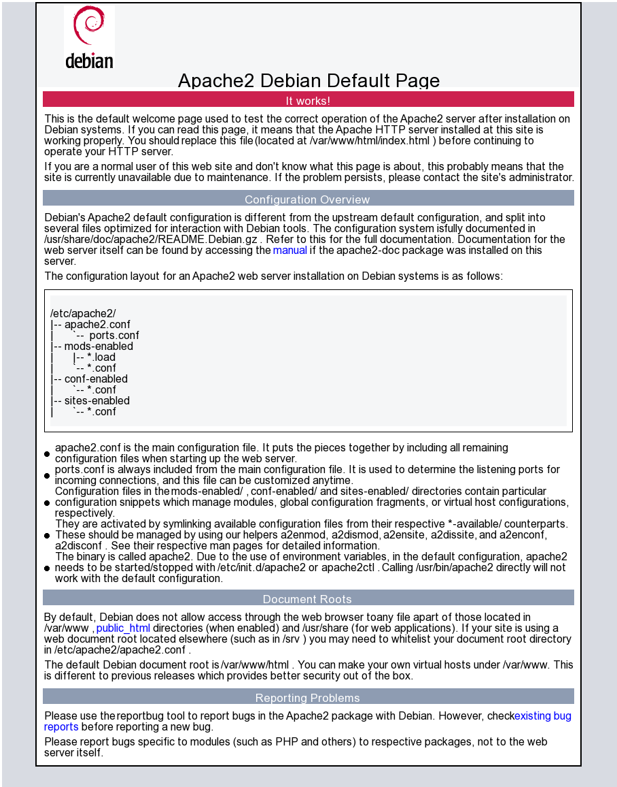

# hinawa

<figure>
  
  <figcaption>Hinawa from Mother 3, after whom this project is named</figcaption>
</figure>

A hobby browser engine to learn how web technologies work.

### Screenshots

Default Apache landing page on Debian

Rendering a raytracer JavaScript HTML canvas demo from [nerget.com](https://nerget.com/rayjs/rayjs.html)

